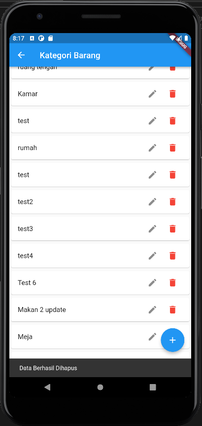

# Hasil run Rest-Api menggunakan Flutter

## 1. GET ListKategoriBarang

## 2. POST AddKategoriBarangView

## 3. POST AddKategoriBarang Laptop 

## 4. PUT UpdateKategoriBarangView

## 5. PUT UpdateKategoriBarang Testing

## 6. DELETE DeleteKategoriBarang

## 7. VIEW TableKategoriBarang now

# practice_api

A new Flutter project.

## Getting Started

This project is a starting point for a Flutter application.

A few resources to get you started if this is your first Flutter project:

- [Lab: Write your first Flutter app](https://docs.flutter.dev/get-started/codelab)
- [Cookbook: Useful Flutter samples](https://docs.flutter.dev/cookbook)

For help getting started with Flutter development, view the
[online documentation](https://docs.flutter.dev/), which offers tutorials,
samples, guidance on mobile development, and a full API reference.
